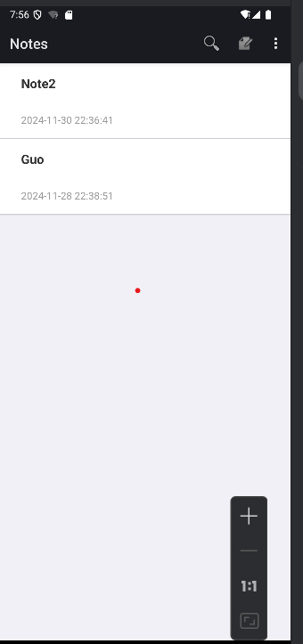
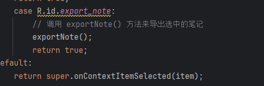

# 期中作业项目文档

   本次项目实现了基于Note_pad笔记本的一些基本功能的实现，其中分为两个必需功能和两个扩展功能。下面将对这四个功能进行效果展示和关键源码的截图展示
    一 必需功能
    1.时间戳的添加。
    添加时间戳功能，对其时间戳功能进行添加，以下是其效果图
   
     该时间显示的是其更新时间，即会随着时间的更改而变化
     关键代码截图如下：
      
      
      

​     2，搜索功能的添加
​    添加搜索功能，为笔记添加搜索功能且能以笔记标题或者内容作为关键词进行模糊查询，以下使其效果图
   
 
   
​    
   根据内容进行搜索

   关键代码截图如下：
   

   二 附加功能
   1.UI美化
   为笔记本的主页编辑页进行一些UI美化包括：
   1.1.1 字体颜色：标题文字使用了较深的颜色 (#333333)，而日期文字采用了浅灰色 (#999999)，使得层次感更加明显。
   1.1.2 字体大小和加粗：标题文字的大小增大到 18sp，并设置为加粗（textStyle="bold"），让标题更加突出。
   1.1.3 内外边距：通过调整 paddingLeft, paddingRight, 和 paddingTop 来为文本提供更多空间，避免文本紧凑感，并且让布局更舒适。
   1.1.4 行间距：为每个 TextView 添加了 lineSpacingExtra，让文本行间距更加宽松，提升可读性。
   1.1.5 阴影和背景：为整个 LinearLayout 添加了 elevation（阴影效果），让界面看起来更有层次感，背景设置为白色（#FFFFFF），使内容更加突出。
   1.1.6 溢出处理：标题文字使用了 ellipsize="end" 来处理超长文本溢出，避免文字被截断。
   效果图如下
   
   对编辑页面进行UI优化包括：
   1.2.1 增加边框和阴影: 使用 elevation 和 background 属性来为 LinedEditText 添加阴影效果，增强其立体感。
   1.2.2 改进字体和颜色: 修改 textColor 和 hintColor 以提高可读性，并为文本设置更好的字体样式。
   1.2.3 调整 padding 和 margin: 优化内外间距，使内容显示更加整齐、舒适。
   1.2.4 优化滚动条和渐变效果: 调整滚动条和渐变效果，使其在长文本时表现更好。
   效果图如下：
   
   主要源码如下
   
   
   2.添加导出笔记功能
   为笔记添加导出笔记功能，可导出到手机的文件中，文件内容包括笔记标题，笔记内容和笔记编辑时间。
   以下为其效果图：
   
   
    根据路径找到导出文件：
    
    
     主要代码如下：
     
     先在list_context_menu中加入导出笔记的菜单选项
     
     这是导出对应内容为txt文件的方法，用于后面导出笔记方法使用
     
     这是获取选中笔记ID的方法，用于后面导出笔记方法使用
     
     这是获取选中笔记内容的方法，用于后面导出笔记方法使用
     
     这是导出笔记的主方法。
      
      将导出笔记主方法绑定在内容菜单中进行使用。
      以上为本次期中实验的汇报。